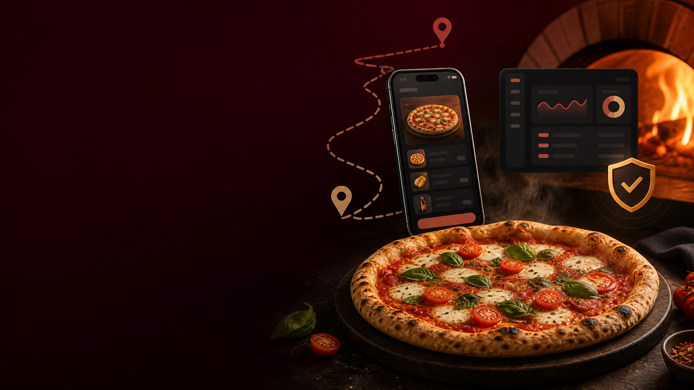

# 🍕 Mania de Pizza — V3



<p align="center">
  
</p>

<p align="center"><strong>Plataforma de pedidos, operação e delivery para pizzarias.</strong></p>

Sistema SaaS completo de delivery para a Mania de Pizza (Queimados-RJ).
**Versão 3** — com hierarquia de aprovação, scanner QR funcional, cadastros estilo iFood e download em ZIP.

---

## 🆕 Novidades da V3

✅ **Login simples e separado do cadastro** — quem já tem conta digita só email + senha
✅ **Novo perfil ATENDENTE** — pessoal do balcão pré-aprova motoboys e registra pedidos presenciais/telefone
✅ **Hierarquia de aprovação** — atendente faz pré-aprovação, gerente dá a palavra final
✅ **Cadastro de cliente estilo iFood** — CEP com autopreenchimento, endereço completo, múltiplos endereços
✅ **Scanner QR 100% funcional** — câmera nativa + jsQR + frame visual
✅ **QR Ponto rotativo (20s)** — TOTP-like com HMAC-SHA256, modo tela cheia para kiosque
✅ **Botão Voltar em todas as telas** — header padronizado em todas as páginas
✅ **Pacote ZIP para download** — `download.html` empacota o projeto inteiro

---

## 🗂 Estrutura do projeto

```
/
├── index.html                 # Landing — escolha de perfil
├── cliente-entrada.html       # Cliente: entrar OU cadastrar
├── motoboy-entrada.html       # Motoboy: entrar OU cadastrar
├── login.html                 # Login unificado (email + senha)
├── cadastro-cliente.html      # Cadastro Cliente (3 etapas com CEP)
├── cadastro-motoboy.html      # Cadastro Motoboy (4 etapas com fotos)
├── comprador.html             # App do Cliente (cardápio, carrinho, rastreio)
├── motoboy.html               # App do Motoboy (scanner QR, GPS, entregas)
├── painel-atendente.html      # Painel Atendente (pré-aprova + balcão)
├── painel-gerente.html        # Painel Gerente (Kanban, alarme, QR, frota)
├── download.html              # Página para baixar ZIP do projeto
├── manifest.json              # PWA manifest
├── sw.js                      # Service Worker
├── README.md                  # Esta documentação
├── css/
│   └── global.css             # Estilos globais compartilhados
└── js/
    ├── security.js            # Núcleo de segurança (sessão, hash, CSRF)
    ├── api.js                 # Wrapper RESTful Table API
    ├── ui.js                  # Helpers de UI (toast, modal, voltar)
    ├── qr-core.js             # Geração e verificação de QR TOTP-like
    ├── validators.js          # CPF, CNH, placa, CEP, telefone
    ├── comprador.js           # Lógica do app cliente
    ├── motoboy.js             # Lógica do app motoboy
    ├── painel-atendente.js    # Lógica do painel atendente
    └── painel-gerente.js      # Lógica do painel gerente
```

---

## 🌐 Rotas (URIs) do sistema

| URI | Quem acessa | Descrição |
|-----|-------------|-----------|
| `/index.html` | Todos | Landing — escolha de perfil |
| `/cliente-entrada.html` | Visitantes | Entrar ou cadastrar como cliente |
| `/motoboy-entrada.html` | Visitantes | Entrar ou cadastrar como motoboy |
| `/login.html` | Todos | Login unificado (`?role=cliente\|motoboy` ou `?staff=1`) |
| `/cadastro-cliente.html` | Visitantes | Wizard 3 etapas: dados → endereço → confirmação |
| `/cadastro-motoboy.html` | Visitantes | Wizard 4 etapas: conta → docs → veículo → fotos |
| `/comprador.html` | Cliente logado | App de pedidos com rastreio mapa |
| `/motoboy.html` | Motoboy ativo | App de entregas + scanner QR |
| `/painel-atendente.html` | Atendente | Pré-aprova motoboys + registra pedidos balcão |
| `/painel-gerente.html` | Gerente / Dono | Kanban + Alarme + QR Ponto + Frota + Produtos |
| `/download.html` | Todos | Gera e baixa ZIP do projeto |

---

## 👥 Hierarquia de perfis e permissões

```
DONO          (futuro: dashboard executivo)
  ↓ supervisiona
GERENTE       → aprova motoboys (final), kanban, QR ponto, força offline
  ↓ supervisiona
ATENDENTE     → pré-aprova motoboys, registra pedidos balcão/telefone
  ↓ aprova
MOTOBOY       → escaneia QR para entrar/sair, faz entregas
CLIENTE       → faz pedido, acompanha entrega no mapa
```

### 🔐 Fluxo de cadastro de motoboy (anti-fraude)

```
Motoboy preenche cadastro completo (CPF + CNH + placa + foto 3x4 + foto CNH)
        ↓
status = "pendente"  ← Atendente vê e valida
        ↓
[ATENDENTE pré-aprova]  ou  [Reprova com motivo]
        ↓
status = "pre_aprovado"  ← Gerente vê e dá palavra final
        ↓
[GERENTE aprova FINAL]  ou  [Reprova com motivo]
        ↓
status = "ativo"  ← Pode fazer login e trabalhar
```

### 🚪 Travas de perfil (anti-burla)

- Cliente que se cadastra como cliente **NUNCA** acessa área de motoboy/staff
- Motoboy que se cadastra **NUNCA** acessa área de cliente
- Login verifica `role` do usuário e bloqueia entrada via URLs erradas
- Logout do motoboy **bloqueado** durante turno ativo

---

## 🔁 Sistema de QR Ponto Rotativo

- **Algoritmo**: `HMAC-SHA256(secret, "MDP-QR-V3:" + slot)`, truncado a 16 chars
- **Slot**: `floor(timestamp_ms / 20000)` → muda a cada 20 segundos
- **Tolerância**: ±1 slot (anti drift de relógio)
- **Comparação timing-safe** (anti side-channel attack)
- **Mesmo QR serve** para check-in E check-out — sistema detecta pelo status

### Como funciona na prática

1. Gerente abre `painel-gerente.html` → aba **🔁 QR Ponto**
2. QR Code gigante aparece, atualizando a cada 20s (com countdown)
3. Botão "Modo tela cheia" abre o QR em janela popup para a TV/tablet do balcão
4. Motoboy chega para trabalhar:
   - Abre `motoboy.html` → toca em **"Escanear QR para iniciar turno"**
   - Câmera abre com frame verde
   - Aponta para o QR → token é validado → status muda para `online`
5. Para encerrar turno: motoboy escaneia o **mesmo** QR novamente
6. Se houver entrega ativa, check-out é **bloqueado** até finalizar

---

## 🚨 Alarme de 5 minutos (geofencing client-side)

Localizado em `js/painel-gerente.js`:

```js
function checkInatividade() {
  motoboysDados.forEach(m => {
    if (m.online && temEntregaAtiva(m)) {
      const distancia = haversine(posicao_5min_atras, posicao_atual);
      if (distancia < 10 && tempo_parado > 5_min) {
        ativarAlarme(m); // pisca card + som + WhatsApp
      }
    }
  });
}
```

Quando dispara:
- Card do pedido **pulsa em vermelho** no Kanban
- **Som de alerta** (audio embutido em base64)
- Painel lateral lista o motoboy + botão **"Acionar WhatsApp"** com mensagem pré-preenchida

---

## 🛡️ Segurança aplicada

### Cliente (`js/security.js`)
- **Senha**: SHA-256 + salt 128 bits hex
- **Sessão**: HMAC-SHA256 + payload base64 + TTL 12h + nonce anti-replay
- **Comparações timing-safe** (operação XOR completa)
- **Anti-XSS**: `escapeHtml()` em 100% das interpolações DOM
- **Anti-clickjacking**: bloqueia exibição em iframes externos
- **Anti-prototype-pollution**: `Object.freeze` em protótipos
- **Rate limiting** (token bucket) em login, cadastro, scanner QR

### Headers HTTP (em todos os HTMLs)
- `Content-Security-Policy` restritiva
- `X-Content-Type-Options: nosniff`
- `Referrer-Policy: strict-origin-when-cross-origin`
- `frame-ancestors: 'none'` (anti-clickjacking server-side)

### Validações reais brasileiras (`js/validators.js`)
- CPF com dígitos verificadores oficiais
- CNH com algoritmo Detran
- Placa Mercosul (AAA0A00) e antiga (AAA0000)
- Telefone (10 ou 11 dígitos)
- CEP + lookup ViaCEP

### Auditoria
- `ponto_log`: todas entradas/saídas de turno + forçamentos offline
- `aprovacoes_log`: todas aprovações/reprovações com quem fez

---

## 🗄 Banco de dados (RESTful Table API)

### Tabelas

| Tabela | Descrição |
|--------|-----------|
| `users` | Todos os usuários (cliente, motoboy, atendente, gerente, dono) |
| `motoboys_dados` | Documentos, veículo e GPS do motoboy |
| `enderecos` | Múltiplos endereços do cliente (estilo iFood) |
| `produtos` | Cardápio com fotos, preços, status ativo |
| `pedidos` | Pedidos com itens, endereço, status, motoboy, origem |
| `ponto_log` | Auditoria de check-in/check-out/forçamentos |
| `qr_secret` | Segredo HMAC compartilhado (singleton) |
| `aprovacoes_log` | Auditoria de aprovações/reprovações de motoboys |

### Endpoints

```
GET    tables/{tabela}              # listar com paginação
GET    tables/{tabela}/{id}         # buscar 1
POST   tables/{tabela}              # criar
PUT    tables/{tabela}/{id}         # atualizar tudo
PATCH  tables/{tabela}/{id}         # atualizar campos
DELETE tables/{tabela}/{id}         # remover (soft delete)
```

---

## 🚀 Como testar (fluxo completo)

Abra **4 abas anônimas** diferentes:

### 1. Aba Gerente
- `index.html` → **Equipe da Loja** → email `gerente@maniadepizza.com` + qualquer senha
- Vai em **🔁 QR Ponto** e deixa aberto

### 2. Aba Motoboy
- `index.html` → **Sou Motoboy** → **Quero me cadastrar**
- Preenche os 4 passos com fotos
- Volta na aba do Gerente: vai em **🛵 Motoboys** → cadastro está em "Aguardando atendente"

### 3. Aba Atendente
- `index.html` → **Equipe da Loja** → email `atendente@maniadepizza.com` + qualquer senha
- Vai em **Motoboys pendentes** → clica em **✓ Pré-aprovar**

### 4. Volta no Gerente
- Aba **🛵 Motoboys** → cadastro agora aparece em "⏳ Aguardando sua aprovação final"
- Clica em **✓ Aprovar FINAL**

### 5. Motoboy faz login
- `index.html` → **Sou Motoboy** → **Já sou motoboy — Entrar**
- Loga com email/senha que cadastrou
- Toca em **📷 Escanear QR para iniciar turno**
- Aponta a câmera para o QR exibido na aba do Gerente
- ✅ Turno iniciado!

### 6. Aba Cliente
- `index.html` → **Sou Cliente** → **Criar minha conta**
- Preenche nome/telefone/email/senha → CEP autopreenche endereço
- Faz pedido no cardápio → checkout
- Acompanha rastreio no mapa em tempo real

### 7. Volta no Gerente
- Kanban: pedido aparece em **📥 Recebidos**
- Avança: **▶ Iniciar preparo** → **✓ Marcar Pronto** → atribui motoboy → **Saiu p/ entrega**
- Vai em **🗺️ Frota ao vivo** para ver a posição do motoboy

### Testes anti-fraude
- ❌ Tenta logout do motoboy em turno → **bloqueado**
- ❌ Tenta encerrar turno com entrega ativa → **bloqueado**
- ✅ Gerente vai em Motoboys → **⏹ Forçar offline** → motoboy sai imediatamente

---

## 🔑 Contas de demonstração (primeira senha define)

| E-mail | Perfil |
|--------|--------|
| `dono@maniadepizza.com` | Dono |
| `gerente@maniadepizza.com` | Gerente |
| `atendente@maniadepizza.com` | Atendente |

> Na primeira vez que você fizer login com qualquer uma delas, o sistema pede confirmação para **definir a senha** que você digitou. Use uma senha forte e a anote.

---

## 📦 Como baixar o projeto em ZIP

1. Abra `index.html` no navegador
2. Role até o final → clique em **📦 Baixar código-fonte (ZIP)**
3. Ou acesse direto: `download.html`
4. Clique em **📥 Gerar e baixar ZIP**
5. O arquivo `mania-de-pizza-v3-AAAA-MM-DD.zip` será baixado

> Tudo é gerado client-side com [JSZip](https://stuk.github.io/jszip/) — nada vai pra servidor externo.

---

## 🏗️ Próximos passos sugeridos

### Fase 4 — Dashboard Executivo do Dono
- [ ] Gráficos financeiros (faturamento por dia/semana/mês)
- [ ] Comparativo "iFood vs. App próprio" (quanto economizou de taxa)
- [ ] Tempo médio de entrega por motoboy/bairro
- [ ] Relatório mensal de incidentes (quantos alarmes 5min dispararam)
- [ ] Gestão de acessos: dono cria/remove gerentes e atendentes

### Fase 5 — Hardening de produção
- [ ] Backend NestJS dedicado (substituir Table API client-side)
- [ ] Autenticação JWT + refresh token httpOnly
- [ ] Argon2id em vez de SHA-256 (servidor-side)
- [ ] PostgreSQL com Row-Level Security multi-tenant
- [ ] Socket.IO para tempo real (substitui polling de 5s)
- [ ] Background Geolocation API real (mantém GPS com tela apagada)
- [ ] Push Notifications (web-push)
- [ ] Integração Mercado Pago (PIX + Cartão)

### Fase 6 — Multi-loja (white-label)
- [ ] Tenant isolation no banco
- [ ] Subdomínio próprio por pizzaria
- [ ] Dashboard SaaS para vender para outras pizzarias
- [ ] Sistema de billing recorrente

---

## 📞 Suporte e contato

Para dúvidas sobre arquitetura, segurança ou novas funcionalidades, abra uma issue no repositório ou entre em contato com a equipe de desenvolvimento.

**Mania de Pizza V3** © 2026 · Queimados, RJ · 🍕
